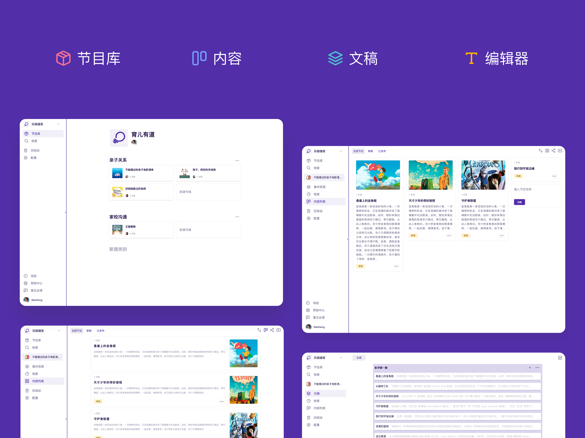
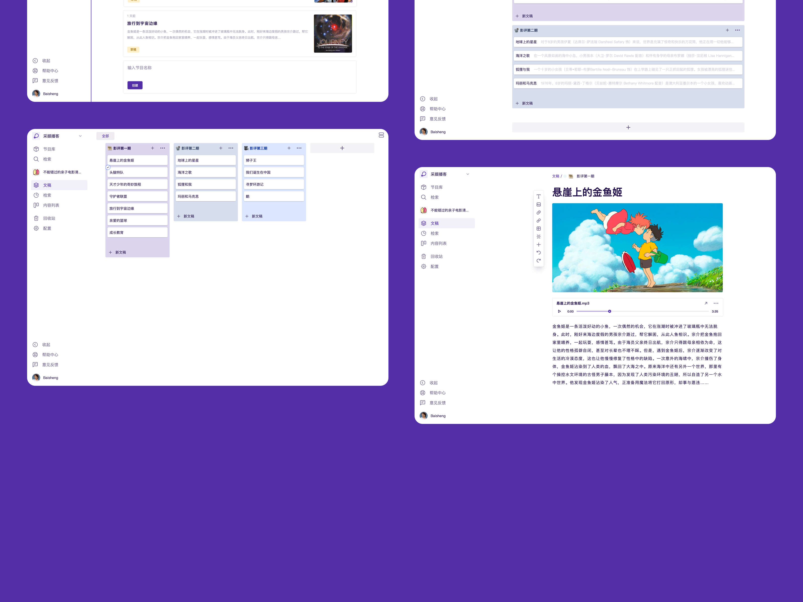
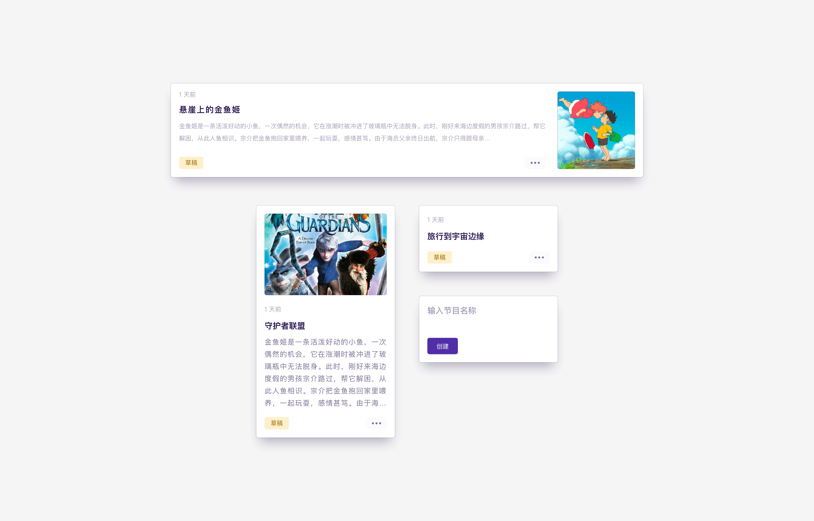
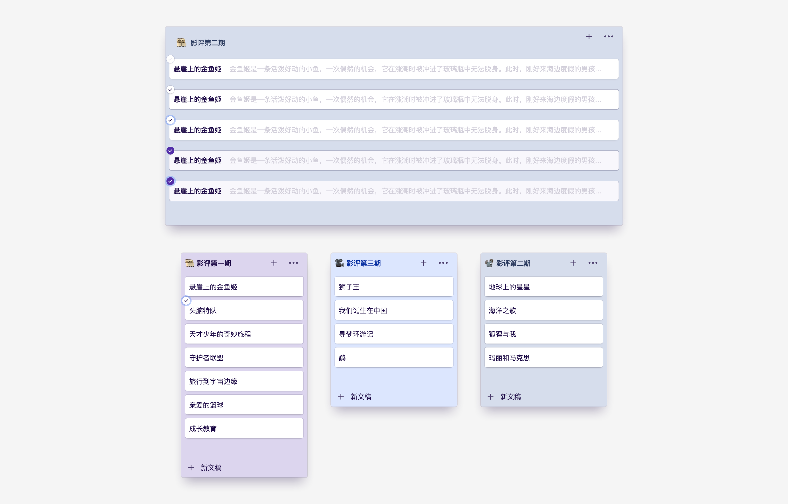

  

<h1 align="center">播客小程序后端系统</h1>

  <b>
  一个播客小程序
  为课程主播提供轻量化、独立运营的播客解决方案。系统采用 TypeScript 编写构建 RESTful API服务</b> 
  Made with ❤️ by <a href="https://github.com/caixie-team">Caixie Team</a>, <a href="https://baisheng.me">Baisheng</a>

 

## ❯ 为什么

项目的灵感来源自我们的一个客户定制需求，针对教育行业中的音频课程应用。

### 产品特色

- **节目管理** 管理节目类别、列表、内容审核等
- **素材管理** 节目素材管理，如封面图片、课件
- **成员管理** 主播、系统成员、用户管理等
- **统计分析** 节目统计、行为统计
- **小程序管理** 小程序的配置、信息管理等

### 技术特色

- **简单的 API 测试** 我们引入了 e2e 测试工具.
- **D** done with the nice framework from [TypeDI](https://github.com/pleerock/typedi).
- **便捷的数据查询** 使用 ORM 框架 [TypeORM](https://github.com/typeorm/typeorm).
- **整洁的代码架构** 基于 [Nestjs](https://https://nestjs.com) 的分层设计，分为 controllers, services, repositories, models, middlewares...
- **API 文档** 采用 [swagger](http://swagger.io/).
- **API 监控** 采用 [express-status-monitor](https://github.com/RafalWilinski/express-status-monitor).
- **集成测试** 采用 [Jest](https://facebook.github.io/jest).
- **E2E API 测试** 采用 [supertest](https://github.com/visionmedia/supertest).
- **基本的安全特性** 采用 [Helmet](https://helmetjs.github.io/).
- **简单的事件调度** 采用 [event-dispatch](https://github.com/pleerock/event-dispatch).
- **快速数据库建设** 通过 [TypeORM](https://github.com/typeorm/typeorm) 简单的迁移.
- **GraphQL 支持** [GraphQL](http://graphql.org/).

## ❯ 文档目录

- [开始](#-getting-started)
- [脚本任务](#-scripts-and-tasks)
- [API 路由](#-api-routes)
- [工程结构](#-project-structure)
- [日志](#-logging)
- [事件调试](#-event-dispatching)
- [测试数据](#-seeding)
- [工程依赖](#-related-projects)
- [版权](#-license)

## ❯ API Routes

路由的默认前缀为 `/api`

| 路由            | 描述         |
| -------------- | ----------- |
| **/api**       | 显示包的名称、描述和版本 |
| **/graphql**   | 路由到graphql编辑器 query/mutations 请求 |
| **/swagger**   | 使用 Swagger UI 的 API 文档 |
| **/monitor**   | 一个简单的服务监控页面 |

## ❯ 管理后台

  

  

  

  

